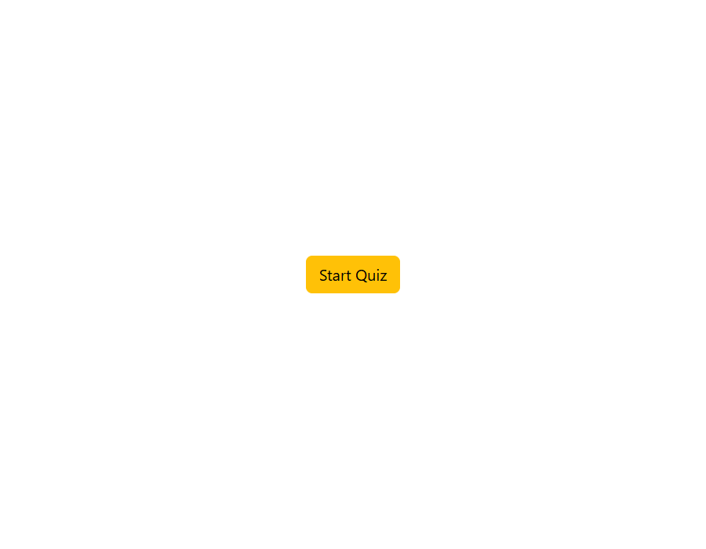
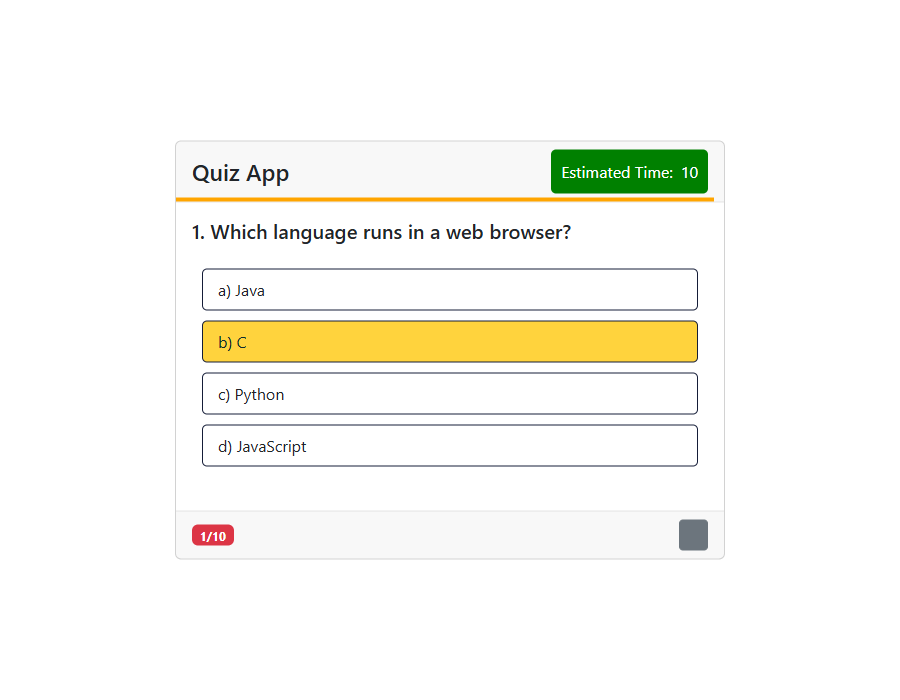
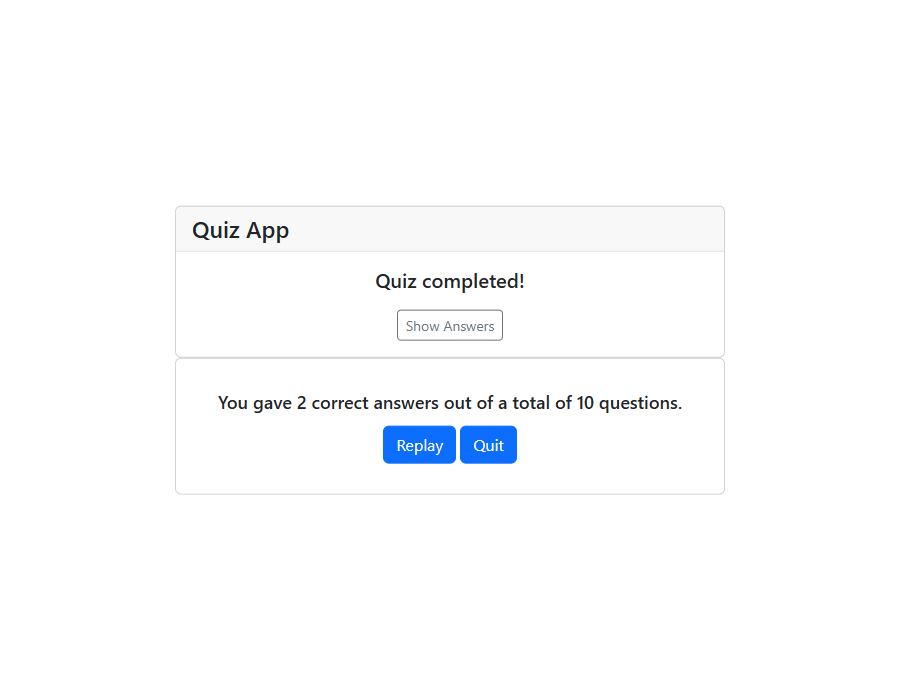
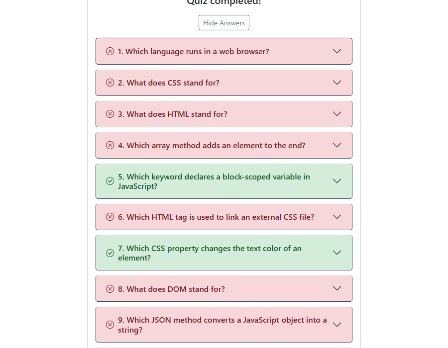

# Quiz App

A simple browser-based quiz app built with vanilla JavaScript, HTML, and Bootstrap 5. Includes a per-question countdown timer, a shrinking progress line, and a collapsible answer review on completion.

## Features

- 10 multiple-choice questions
- Per-question countdown timer with a visual progress line
- Score summary with a trophy that changes color based on your score
- Collapsible, color-coded review of correct/incorrect answers
- Replay and quit options

## Screenshots

### Start screen

### Question screen

### Completed screen

### Answer review

## Usage

Open `index.html` in your browser — no build step or server required.
